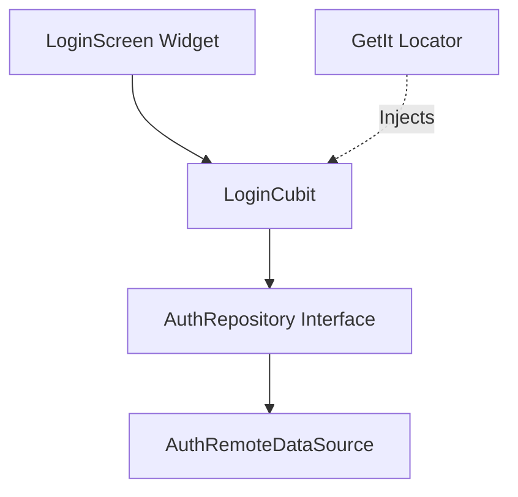

# Technical Plan: User Authentication (Login)

**Feature Reference**: [`spec.md`](./spec.md)  
**Status**: `APPROVED`  
**Architecture Pattern**: Feature-First Clean Architecture

---

## 1. Technical Architecture & Component Flow



---

## 2. File Layout
```text
lib/
├── core/
│   ├── di/injection.dart
│   └── errors/failures.dart
└── features/
    └── auth/
        ├── domain/
        │   ├── entities/user.dart
        │   └── repositories/auth_repository.dart
        └── presentation/
            └── cubit/
                ├── login_cubit.dart
                └── login_state.dart
test/
└── features/
    └── auth/
        └── presentation/cubit/login_cubit_test.dart
```

---

## 3. Public Interfaces & Contracts

```dart
abstract class AuthRepository {
  Future<User> login({required String email, required String password});
}

class User extends Equatable {
  final String id;
  final String email;
  const User({required this.id, required this.email});
  @override
  List<Object?> get props => [id, email];
}
```

---

## 4. Error Handling Matrix

| Condition | Failure Type | UI Message |
| :--- | :--- | :--- |
| Network Timeout | `NetworkFailure` | "Connection timed out. Please try again." |
| Invalid Password | `AuthFailure` | "Invalid email or password." |
| Server Exception (500) | `ServerFailure` | "An unexpected server error occurred." |
