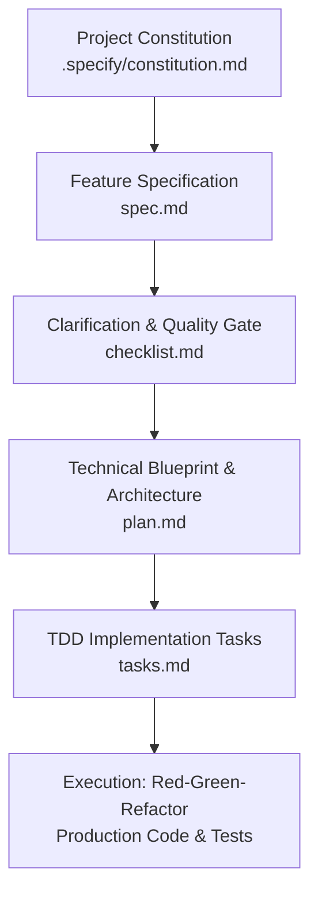

# GitHub Spec-Kit: Spec-Driven Development (SDD) Guide

## 1. What is GitHub Spec-Kit?

[GitHub Spec-Kit](https://github.com/github/spec-kit) is an open-source framework developed to standardize **Spec-Driven Development (SDD)** when building software with AI coding agents (such as Google Antigravity, Anthropic Claude Code, and GitHub Copilot).

Instead of "vibe coding" (ad-hoc prompting where code is produced without clear architecture or constraints), Spec-Kit establishes a disciplined, repeatable sequence of version-controlled markdown artifacts:



---

## 2. The Spec-Kit Artifact Pipeline

Every feature developed with Spec-Kit produces structured artifacts stored under `.specify/specs/<feature-name>/`:

### 1. Constitution (`constitution.md`)
- **Purpose**: Defines the non-negotiable laws and constraints of the repository.
- **Location**: `.specify/constitution.md`
- **Scope**: Applied across all features. Governs testing bars (e.g., 100% TDD mandatory), security mandates, coding style, and framework choices.

### 2. Specification (`spec.md`)
- **Purpose**: Defines **WHAT** to build and **WHY**, completely free of premature implementation details.
- **Contents**:
  - Problem Statement & Goals
  - User Stories with measurable outcomes
  - Domain Entities & System Invariants
  - Acceptance Criteria (Given-When-Then)
  - Edge Cases & Boundary Limits

### 3. Technical Plan (`plan.md`)
- **Purpose**: Defines **HOW** to build the feature technically.
- **Contents**:
  - System Architecture & Component Diagram
  - Public Interface Contracts & Function Signatures
  - Data Models & Schema Definitions
  - Error Handling Matrix
  - Technology & Dependency Decisions

### 4. Tasks (`tasks.md`)
- **Purpose**: Translates the technical plan into granular, dependency-ordered tasks structured for **Test-Driven Development (TDD)**.
- **Structure**:
  - Phase 1: Setup & Interfaces
  - Phase 2: Core Domain Logic (Each item pairs a failing test with minimal implementation)
  - Phase 3: Integration & Edge Cases
  - Phase 4: Refactoring, Typing, & Lints

### 5. Checklist (`checklist.md`)
- **Purpose**: Acts as an automated quality gate confirming that the implementation fulfills all constitutional and specification requirements before merging.

---

## 3. Pairing Spec-Kit with Test-Driven Development (TDD)

Spec-Kit provides the specification foundation that makes TDD effortless for AI agents:

1. **Unambiguous Acceptance Criteria**: Every criterion in `spec.md` directly translates to a unit or integration test in the **Red** phase.
2. **Preventing Scope Creep**: The agent only implements code explicitly mapped to tasks in `tasks.md`.
3. **Refactoring Safety**: The domain invariants documented in `spec.md` and `plan.md` ensure that refactoring never breaks core business logic.

---

## 4. Local CLI Support (`tools/speckit.py`)

This repository provides built-in tooling to automate the GitHub Spec-Kit workflow:

```bash
# Initialize project constitution
python tools/speckit.py init

# Scaffold a new feature specification
python tools/speckit.py specify <feature-name>

# Scaffold technical plan
python tools/speckit.py plan <feature-name>

# Scaffold TDD task list
python tools/speckit.py tasks <feature-name>

# Check progress across all features
python tools/speckit.py status
```
