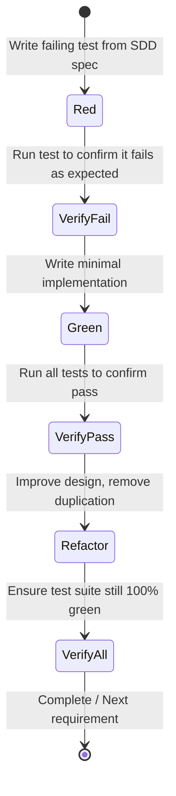

# Test-Driven Development (TDD) Lifecycle Guide

## 1. The Red-Green-Refactor Cycle

The essence of Test-Driven Development (TDD) is short, rapid iterations governed by strict feedback loops:

---

## 2. The Golden Rules of TDD for Agents

1. **Never write implementation code without a failing test.**
   If you have not witnessed the test fail, you do not know if the test is actually asserting anything or passing accidentally.

2. **Verify the failure mode.**
   Ensure the test fails with an assertion failure (e.g., `AssertionError: expected 10, got None`), NOT an unexpected syntax error, missing test fixture, or module import failure.

3. **Write the simplest code that passes the test.**
   Do not optimize early. Do not build speculative features. Do not add unrequested abstractions.

4. **Refactor under the safety net.**
   Refactoring means changing the *structure* of code without altering its *observable behavior*. During refactoring:
   - Extract helper functions or classes.
   - Enforce static typing and descriptive variable names.
   - Remove duplicate logic.
   - Run tests after every small edit.

---

## 3. Test Double Strategies

When dealing with external dependencies (databases, network calls, file I/O, system clock):

- **Dummy**: Objects passed around but never actually used (e.g., filling parameter lists).
- **Stub**: Provides canned responses to calls made during the test.
- **Spy**: Stubs that also record information about how they were called (e.g., call counts, arguments).
- **Mock**: Objects pre-programmed with expectations which form a specification of the calls they are expected to receive.
- **Fake**: Working implementation with a shortcut (e.g., in-memory SQLite instead of PostgreSQL).

### Rule for Agents:
Prefer **Fakes** or pure function isolation over deep mocking of internal implementation details. Mocking internals leads to brittle tests that break during refactoring even when behavior is preserved.
