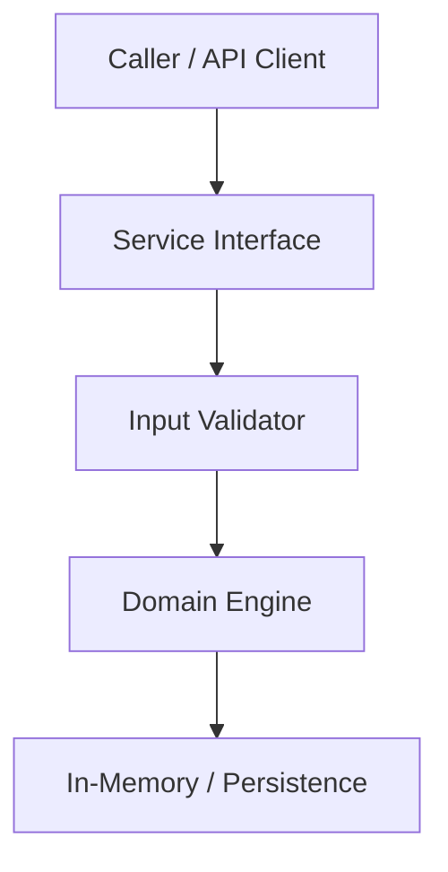

# Technical Plan: [Feature Name]

**Specification Reference**: [`spec.md`](./spec.md)  
**Status**: [DRAFT | APPROVED]  

---

## 1. Technical Architecture & Component Flow



---

## 2. File & Directory Structure
```text
src/
└── [module]/
    ├── __init__.py
    ├── interface.py      # Abstract contracts & data schemas
    └── service.py        # Core logic adhering to invariants
tests/
└── test_[module].py      # TDD unit & integration test suites
```

---

## 3. Public Interfaces & Data Contracts

```python
from dataclasses import dataclass
from typing import Optional

@dataclass(frozen=True)
class RequestPayload:
    id: str
    amount: float

class ServiceInterface:
    def process(self, payload: RequestPayload) -> dict: ...
```

---

## 4. Error Handling & Edge Case Matrix

| Condition | Raised Error | Mitigation / Recovery |
| :--- | :--- | :--- |
| Empty payload | `ValueError("Payload cannot be empty")` | Return HTTP 400 |
| Invariant breach | `InvariantViolationError` | Abort transaction |
| Timeout / Unreachable | `TransientNetworkError` | Exponential backoff retry |

---

## 5. Human Review Gate (🚦 GATE 3)

- [ ] **Architecture Blueprint**: Component interactions and boundaries validated.
- [ ] **Data Contracts**: Public interface signatures, payloads, and return types approved.
- [ ] **Error Matrix**: Failure modes and recovery behaviors confirmed complete.
- [ ] **Open Architectural Questions Resolved**:
  - [ ] Q1: [Agent question regarding dependency, concurrency, or persistence trade-off]
  - [ ] Q2: [Agent question regarding backward compatibility or schema versioning]

**Human Approval Sign-Off**:
- **Reviewer**: `[Human User / Architect]`
- **Status**: `[PENDING | APPROVED | REVISION_REQUESTED]`
- **Date**: `[YYYY-MM-DD]`

